  

  <strong>Information security systems engineer building backend and network-facing software in Rust.</strong>

  Protocols, sockets and Linux primitives — with reproducible systems built around Nix.

  
  
  

<h2>⚙️ What I work on</h2>

<h3>🦀 Rust backend</h3>

Async services with <strong>Tokio</strong>, <strong>Axum</strong>, <strong>Tower HTTP</strong>, <strong>gRPC</strong> and <strong>PostgreSQL</strong> — plus terminal interfaces with <strong>Ratatui</strong>.

<h3>🌐 Network software</h3>

Protocol-level integrations and services built directly on <strong>TCP/IP</strong>, <strong>Unix domain sockets</strong> and Linux primitives.

<h3>❄️ Reproducible infrastructure</h3>

NixOS systems, flakes and CI/CD for servers and distributed agents, with <strong>Caddy</strong>, <strong>Nginx</strong> and <strong>Docker</strong> at the edge.

<h2>🧰 Toolbox</h2>

  

  
  
  
  

<h2>🚀 Selected work</h2>

<h3><a href="https://github.com/Teamofeyy/fast-webp">fast-webp</a></h3>

A narrow, fast WebP encoder for Rust: image buffers or JPEG/PNG payloads in, WebP bytes out through a short <code>libwebp-sys</code> hot path.

  
  
  

<h3><a href="https://github.com/Teamofeyy/rust-snippets">Rust snippets for Zed</a></h3>

Practical snippets that keep recurring Rust workflows close at hand inside the Zed editor.

<h3><a href="https://github.com/NixOS/nixpkgs/pull/554287">Look → Nixpkgs</a></h3>

Packaging and validation work for bringing the Rust/Tauri launcher Look into Nixpkgs with reproducible builds and clean dependencies.

<h2>🧪 Currently exploring</h2>

> [!NOTE]
> <strong>3D graphics from first principles.</strong> I am implementing an OpenGL-like rendering pipeline in Rust to understand transforms, rasterization and the machinery beneath high-level graphics APIs — rather than treating the GPU as a black box.

I am also going deeper into Linux internals: system calls, virtual memory, scheduling, concurrency, atomics and synchronization.

<h2>📊 GitHub activity</h2>

  

  Explicit systems. Reproducible infrastructure. No black boxes.

